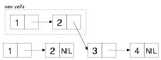

# Functional Programming and Lists（函数式编程和列表）

The essence of functional programming is that programs are built
entirely of functions with no side effects that compute their results
based solely on the values of their arguments. The advantage of the
functional style is that it makes programs easier to
understand. Eliminating side effects eliminates almost all
possibilities for action at a distance. And since the result of a
function is determined only by the values of its arguments, its
behavior is easier to understand and test. For instance, when you see
an expression such as `(+ 3 4)`, you know the result is uniquely
determined by the definition of the + function and the values 3
and 4. You don't have to worry about what may have happened earlier in
the execution of the program since there's nothing that can change the
result of evaluating that expression.

函数式编程的本质在于，程序完全由没有副作用的函数组成，也就是说，函数完全基于其参数的值来计算结果。函数式风格的好处在于它使得程序更易于理解。在消除副作用的同时也消除了所有超距作用的可能。并且由于一个函数的结果仅取决于其参数的值，因此它的行为更容易被理解和测试。例如，当看到像
`(+ 3 4)`
这样的表达式时，你知道其结果完全取决于 `+`
函数的定义以及值 3 和
4。你不需要担心程序执行以前发生的事，因为没有什么可以改变该表达式的求值结果。

Functions that deal with numbers are naturally functional since
numbers are immutable. A list, on the other hand, can be mutated, as
you've just seen, by **SETF**ing the **CAR**s and **CDR**s of the cons cells that
make up its backbone. However, lists can be treated as a functional
data type if you consider their value to be determined by the elements
they contain. Thus, any list of the form `(1 2 3 4)` is functionally
equivalent to any other list containing those four values, regardless
of what cons cells are actually used to represent the list. And any
function that takes a list as an argument and returns a value based
solely on the contents of the list can likewise be considered
functional. For instance, the **REVERSE** sequence function, given the
list `(1 2 3 4)`, always returns a list `(4 3 2 1)`. Different calls to
**REVERSE** with functionally equivalent lists as the argument will return
functionally equivalent result lists. Another aspect of functional
programming, which I'll discuss in the section "Mapping," is the use
of higher-order functions: functions that treat other functions as
data, taking them as arguments or returning them as results.

处理数字的函数天生是函数式的，因为数字都是不可改变的对象。另一方面，如同刚刚看到的那样，通过
**SETF** 构成点对单元的 **CAR** 和
**CDR**，列表是可改变的。但列表可以被当作函数式数据类型来对待，只要将其值视为是由它们包含的元素所决定的即可。这样，形式
`(1 2 3 4)` 所表示的任何列表在函数式意义上就将等价于任何其他含有这四个值的列表，无论实际表示该列表的是什么点对单元。并且任何接受一个列表作为实参且其返回值完全依赖于列表内容的函数也可以同样被认为是函数式的。例如，当给定列表
`(1 2 3 4)` 时，序列函数 **REVERSE** 总是返回列表
`(4 3 2 1)`。但由函数式等价的列表作为参数的不同 **REVERSE**
调用将返回函数式等价的结果列表。我将在第 12.6
节里讨论的函数式编程的另一个方面，即对高阶函数的使用：函数将其他函数作为数据来对待，接受它们作为实参或是返回它们作为
结果。

Most of Common Lisp's list-manipulation functions are written in a
functional style. I'll discuss later how to mix functional and other
coding styles, but first you should understand a few subtleties of the
functional style as applied to lists.

多数 Common Lisp
的列表操作函数都以函数式风格写成的。我将在后面讨论如何将函数式风格和其他编码风格混合在一起使用，但首先应当理解函数式风格应用在列表上的一些微妙之处。

The reason most list functions are written functionally is it allows
them to return results that share cons cells with their arguments. To
take a concrete example, the function **APPEND** takes any number of list
arguments and returns a new list containing the elements of all its
arguments. For instance:

多数列表函数之所以会用函数式编写，是因为这能使它们返回与其实参共享点对单元的结果。举一个具体的例子，函数
**APPEND** 可接受任意数量的列表实参并返回一个含有其参数列表的所有元素的新列表。例如：

```lisp
(append (list 1 2) (list 3 4)) ==> (1 2 3 4)
```

From a functional point of view, **APPEND**'s job is to return the
list
`(1 2 3 4)` without modifying any of the cons cells in the lists
`(1 2)` and
`(3 4)`. One obvious way to achieve that goal is to create a completely
new list consisting of four new cons cells. However, that's more work
than is necessary. Instead, **APPEND** actually makes only two new cons
cells to hold the values 1 and 2, linking them together and pointing
the **CDR** of the second cons cell at the head of the last argument, the
list `(3 4)`. It then returns the cons cell containing the 1. None of
the original cons cells has been modified, and the result is indeed
the list `(1 2 3 4)`. The only wrinkle is that the list returned by
APPEND shares some cons cells with the list `(3 4)`. The resulting
structure looks like this:

从函数式观点来看，**APPEND** 的工作是返回列表 `(1 2 3 4)`
而无需修改列表 `(1 2)` 和 `(3 4)`
中的任何点对单元。显然，为了实现该目标可以创建由四个新的点对单元组成的新列表。但这样做并无必要。相反，**APPEND**
实际上只用两个新的点对单元来持有值 1 或
2，然后将它们连接在一起，并把第 2 个点对单元的 **CDR** 指向最后一个实参—列表
`(3 4)` 的头部。然后它返回含有 1
的那个新生成的点对单元。没有原先的点对单元被修改过，并且结果确实是列表
`(1 2 3 4)`。唯一美中不足的是 **APPEND**
返回的列表与列表 `(3 4)` 共享了一些点对单元。产生的结构如下所示：



In general, **APPEND** must copy all but its last argument, but it can
always return a result that shares structure with the last argument.

一般而言，**APPEND**
必须复制除最后一个实参以外的所有其他实参，但它的返回结果却总是会与其最后一个实参共享结构。

Other functions take similar advantage of lists' ability to share
structure. Some, like **APPEND**, are specified to always return results
that share structure in a particular way. Others are simply allowed to
return shared structure at the discretion of the implementation.

其他一些函数也相似地利用了列表共享结构的能力。一些像 **APPEND**
这样的函数被指定总是返回以特定方式共享结构的结果。其他函数则被简单地允许根据具体实现而定来返回共享的结构。

