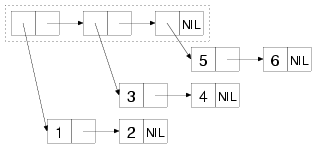

# Trees（树）

Treating structures built from cons cells as trees is just about as
natural as treating them as lists. What is a list of lists, after all,
but another way of thinking of a tree? The difference between a
function that treats a bunch of cons cells as a list and a function
that treats the same bunch of cons cells as a tree has to do with
which cons cells the functions traverse to find the values of the list
or tree. The cons cells traversed by a list function, called the list
structure, are found by starting at the first cons cell and following
**CDR** references until reaching a **NIL**. The elements of the list are the
objects referenced by the **CAR**s of the cons cells in the list
structure. If a cons cell in the list structure has a **CAR** that
references another cons cell, the referenced cons cell is considered
to be the head of a list that's an element of the outer list.1 Tree
structure, on the other hand, is traversed by following both **CAR** and
**CDR** references for as long as they point to other cons cells. The
values in a tree are thus the atomic--non-cons-cell-values referenced
by either the **CAR**s or the **CDR**s of the cons cells in the tree
structure.

由点对单元构建的数据结构既然可被看作成列表，自然也可被看成是树。毕竟，换另一种思考方式，树不就是一种列表的列表么？将一组点对单元作为列表来看待的函数与将同样的点对单元作为树来看待的函数，其区别就在于函数将到哪些点对单元里去寻找该列表或树的值。由一个列表函数所查找的点对单元称为列表结构，其查找方式是以第一个点对单元开始，然后跟着
**CDR** 引用直到遇到 **NIL**。列表元素就是由列表结构点对单元的
**CAR** 所引用的对象。如果列表结构中的一个点对单元带有一个引用到其他点对单元的
**CAR**，那么被引用的点对单元将被视为作为外部列表元素的一个列表的头部。
而另一方面，树结构则是同时跟随
**CAR** 和 **CDR**
引用，只要它们指向其他点对单元。因此，树中的值就是该树结构中所有点对单元引用的非点对单元的值。

For instance, the following box-and-arrow diagram shows the cons cells
that make up the list of lists: `((1 2) (3 4) (5 6))`. The list
structure includes only the three cons cells inside the dashed box
while the tree structure includes all the cons cells.

例如，下面的方框和箭头图例显示了构成列表的列表
`((1 2) (3 4) (5 6))`
的点对单元。列表结构仅包括虚线框之内的三个点对单元，而树结构则包含全部的点对单元。



To see the difference between a list function and a tree function, you
can consider how the functions **COPY-LIST** and **COPY-TREE** will copy this
bunch of cons cells. **COPY-LIST**, as a list function, copies the cons
cells that make up the list structure. That is, it makes a new cons
cell corresponding to each of the cons cells inside the dashed
box. The **CAR**s of each of these new cons cells reference the same
object as the **CAR**s of the original cons cells in the list
structure. Thus, **COPY-LIST** doesn't copy the sublists `(1 2)`, `(3 4)`, or
`(5 6)`, as shown in this diagram:

为了搞清列表函数和树函数之间的区别，你可以考查一下函数
**COPY-LIST** 和 **COPY-TREE**
复制这些点对单元的方式。作为一个列表函数 **COPY-LIST**
只复制那些构成列表结构的点对单元。也就是说，它根据虚线框之内的每个点对单元生成一个对应的新点对单元。每一个这些新点对单元的CAR均指向与原来列表结构中的点对单元的CAR相同的对象。这样，**COPY-LIST**
就不会复制子列表 `(1 2)`、`(3 4)` 或 `(5 6)`，如下图所示：


**COPY-TREE**, on the other hand, makes a new cons cell for each of the
cons cells in the diagram and links them together in the same
structure, as shown in this diagram:

另一方面，**COPY-TREE**
将会为图中的每个点对单元都生成一个新的点对单元，并将它们以相同的结构连接在一起，如下图所示：


Where a cons cell in the original referenced an atomic value, the
corresponding cons cell in the copy will reference the same
value. Thus, the only objects referenced in common by the original
tree and the copy produced by **COPY-TREE** are the numbers 1-6, and the
symbol **NIL**.

当原先的点对单元中引用了一个原子值时，复制中的相应点对单元也将指向相同的值。这样，由原先的树和
**COPY-TREE** 所产生的复制共同引用的唯一对象就是数字 1-6 以及符号 **NIL**。

Another function that walks both the **CAR**s and the **CDR**s of a tree of
cons cells is **TREE-EQUAL**, which compares two trees, considering them
equal if the tree structure is the same shape and if the leaves are
**EQL** (or if they satisfy the test supplied with the `:test` keyword
argument).

另一个在树的点对单元的 **CAR** 和 **CDR** 上都进行遍历的函数是
**TREE-EQUAL**，它会比较两棵树，当这两棵树具有相同的形状以及它们对应的叶子是
**EQL** 等价时（或者如果它们满足带有 `:test`
关键字参数的测试），函数就认为它们相等。

Some other tree-centric functions are the tree analogs to the
**SUBSTITUTE** and **NSUBSTITUTE** sequence functions and their `-IF` and
`-IF-NOT` variants. The function **SUBST**, like **SUBSTITUTE**, takes a new
item, an old item, and a tree (as opposed to a sequence), along with
`:key` and `:test` keyword arguments, and it returns a new tree with the
same shape as the original tree but with all instances of the old item
replaced with the new item. For example:

其他一些以树为中心处理对象的函数包括 **SUBSTITUTE**
和 **NSUBSTITUTE**
这两个序列函数用于树的类似版本及其 `-IF` 和 `-IF-NOT`
变体。函数 **SUBST** 会像 **SUBSTITUTE**
一样接受一个新项、一个旧项和一棵树（跟序列的情况刚好相反），以及 `:key` 和 `:test`
关键字参数，然后返回一棵与原先的树具有相同形状的新树，只不过其中所有旧项的实例都被替换成新项。例如：

```lisp
CL-USER> (subst 10 1 '(1 2 (3 2 1) ((1 1) (2 2))))
(10 2 (3 2 10) ((10 10) (2 2)))
```

**SUBST-IF** is analogous to **SUBSTITUTE-IF**. Instead of an old item, it
takes a one-argument function--the function is called with each atomic
value in the tree, and whenever it returns true, the position in the
new tree is filled with the new value. **SUBST-IF-NOT** is the same except
the values where the test returns **NIL** are replaced. **NSUBST**, **NSUBST-IF**,
and **NSUBST-IF-NOT** are the recycling versions of the **SUBST**
functions. As with most other recycling functions, you should use
these functions only as drop-in replacements for their nondestructive
counterparts in situations where you know there's no danger of
modifying a shared structure. In particular, you must continue to save
the return value of these functions since you have no guarantee that
the result will be **EQ** to the original tree.

**SUBST-IF** 与 **SUBSTITUTE-IF**
相似。它接受一个单参数函数而不是一个旧项，该函数在树的每一个原子值上都会被调用，并且当它返回真时，新树中的对应位置将被填充成新值。
**SUBST-IF-NOT** 也是一样，只不过那些测试返回NIL的值才会被替换。**NSUBST**、
**NSUBST-IF** 和 **NSUBST-IF-NOT** 是 **SUBST**
系列函数的回收性版本。和其他大多数回收性函数一样，只有在明确知道不存在修改共享结构的危险时，才可以将这些函数作为它们非破坏性同伴的原位替代品来使用。特别的是，你必须总是保存这些函数的返回值，因为无法保证其结果与原先的树是
**EQ** 等价的。

