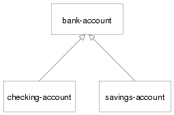

# DEFGENERIC

To give you a feel for these macros and the various facilities they
support, I'll show you some code you might write as part of a banking
application--or, rather, a toy banking application; the point is to
look at a few language features, not to learn how to really write
banking software. For instance, this code doesn't even pretend to deal
with such issues as multiple currencies let alone audit trails and
transactional integrity.

为了给你一个关于这些宏和它们所支持的不同功能的大致印象，我将向你展示一些可能作为一个银行应用，或者说，一个相当幼稚的银行应用的一部分来编写的代码。重点在于观察一些语言特性而不是学习如何实际编写银行软件。例如，这些代码甚至并不打算处理像多种货币、审查跟踪以及事务集成这样的问题。

Because I'm not going to discuss how to define new classes until the
next chapter, for now you can just assume that certain classes already
exist: for starters, assume there's a class `bank-account` and that it
has two subclasses, `checking-account` and `savings-account`. The class
hierarchy looks like this:

由于我不准备在下一章之前讨论如何定义新的类，因此目前你可以假设特定的类已经存在了。假设你已有一个
`bank-account` 类以及它的两个子类 `checking-account` 和
`savings-account`。类层次关系如下所示：



The first generic function will be `withdraw`, which decreases the
account balance by a specified amount. If the balance is less than the
amount, it should signal an error and leave the balance unchanged. You
can start by defining the generic function with **DEFGENERIC**.

第一个广义函数将是
`withdraw`，它将帐户余额减少指定数量。如果余额小于提款量，它将报错并保持余额不变。你可以从通过
**DEFGENERIC** 定义该广义函数开始。

The basic form of **DEFGENERIC** is similar to **DEFUN** except with no
body. The parameter list of **DEFGENERIC** specifies the parameters that
must be accepted by all the methods that will be defined on the
generic function. In the place of the body, a **DEFGENERIC** can contain
various options. One option you should always include is
`:documentation`, which you use to provide a string describing the
purpose of the generic function. Because a generic function is purely
abstract, it's important to be clear to both users and implementers
what it's for. Thus, you might define `withdraw` like this:

**DEFGENERIC** 的基本形式与 **DEFUN**
相似，只是没有函数体。**DEFGENERIC**
的形参列表指定了那些定义在该广义函数上的所有方法都必须接受的参数。在函数体的位置上， **DEFGENERIC**
可能含有不同的选项。一个你应当总是带有的选项是
`:documentation`，它提供了一个用来描述该广义函数用途的字符串。由于广义函数是纯抽象的，让用户和实现者了解它的用途将是重要的。因此，你可以像下面这样定义 `withdraw`：

```lisp
(defgeneric withdraw (account amount)
  (:documentation "Withdraw the specified amount from the account.
Signal an error if the current balance is less than amount."))
```

